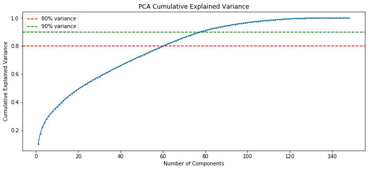
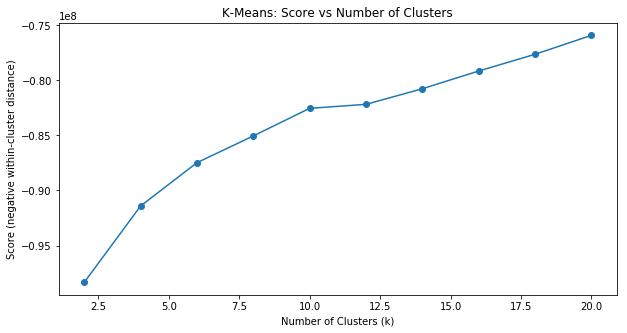
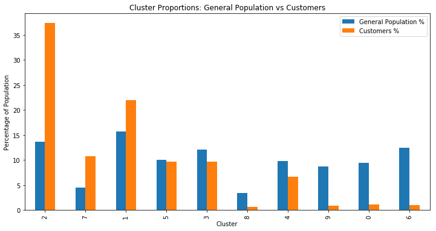

# Identify Customer Segments: Who Should a Mail-Order Company Target?

**Unsupervised Machine Learning | Python, Scikit-learn, PCA, K-Means**

## Business Questions

- Which segments of the German general population make up the core customer base of a mail-order sales company?
- Are certain demographic segments over-represented among customers relative to the general population — i.e., who should marketing campaigns prioritize to get the highest expected return?
- Which segments are under-represented, and therefore poor targets for acquisition spend?

This project applies unsupervised learning (PCA + K-means clustering) to real demographic data to answer those questions, using data provided by Bertelsmann Arvato Analytics through Udacity.

**Full analysis notebook:** [Identify_Customer_Segments.ipynb](./Identify_Customer_Segments.ipynb)
**Rendered HTML export:** [Identify_Customer_Segments.html](./Identify_Customer_Segments.html)

> **A note on the data:** This project uses real demographic data (general population and customer datasets, ~85 features each) licensed to Udacity by Bertelsmann Arvato Analytics for coursework use only. Per that license, the raw data files are **not included in this repository** — only the analysis notebook (with all outputs already computed) and the resulting charts.

## Approach

1. **Clean the data.** Converted per-column missing-value codes to `NaN`, then assessed missingness by both column and row. Rows with more than 20 missing values formed a clearly distinct, more homogeneous subgroup — likely a different population segment, not just noisier data — and were set aside from the main clustering analysis.
2. **Encode features.** Re-encoded categorical and mixed-type features into forms usable by clustering algorithms — e.g. splitting a combined "youth movement" feature into separate decade and mainstream-vs-avantgarde variables, and a combined wealth/life-stage code into separate ordinal features.
3. **Scale and reduce dimensionality.** Imputed remaining missing values, standardized all ~148 engineered features, then applied PCA.

   

   80 principal components were kept, capturing roughly 90-91% of total variance — a large majority of the information in the original ~148 features, at roughly half the dimensionality. The first two components turned out to be interpretable on their own: PC1 reads as a **wealth/affluence axis** tied to housing density (affluent homeowners in lower-density areas vs. more urban, higher-mobility households), and PC2 as a **generational/values axis** (pleasure-seeking and financially indulgent vs. traditional, dutiful, and saving-oriented).

4. **Cluster the general population.** Applied K-means across a range of cluster counts to find a natural elbow point.

   

   The within-cluster distance improved sharply up through **k=10**, after which additional clusters produced only marginal, roughly linear gains — so 10 clusters were kept as the segmentation, balancing meaningful separation against how interpretable that many segments actually are.

5. **Compare customers to the general population.** Applied the exact same cleaning, scaling, PCA, and cluster assignment (fit only on the general population) to the customer dataset, then compared how customers distribute across those 10 clusters versus the general population.

   

## Answer: Who's Over- and Under-Represented?

**Cluster 2 is dramatically over-represented among customers — 37.4% of customers vs. only 13.7% of the general population.** That cluster's centroid corresponds to an **older generation (roughly 1960s birth decade)**, with residential and lifestyle indicators pointing to **established, moderately urban households**. Clusters 7 and 1 are over-represented to a lesser degree.

At the other end, **clusters 6, 0, and 9 are the most under-represented** segments among customers relative to the general population.

## Conclusion

The mail-order company's core customer base skews clearly toward an older, financially established, moderately urban demographic — not a representative cross-section of the general population. Marketing spend aimed at replicating Cluster 2's profile should see the highest expected return, while the most under-represented clusters are poor acquisition targets for this company's current product mix.

## Tools & Libraries

Python, Pandas, NumPy, Scikit-learn (PCA, K-Means, StandardScaler, SimpleImputer, OneHotEncoder), Matplotlib, Seaborn
